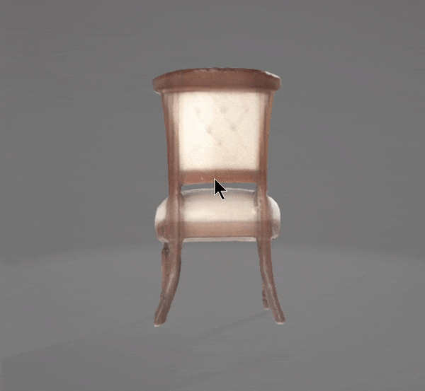

# SF3D: Stable Fast 3D Mesh Reconstruction with UV-unwrapping and Illumination Disentanglement

## VI3W Task

<div align="center">
  
</div>

<br>

This is the task given by VI3W and is a codebase for **Stable Fast 3D**, a state-of-the-art open-source model for **fast** feedforward 3D mesh reconstruction from a single image.

<br>

## Task 1: Install and Run the Open-Source AI Project Offline
1. Clone the provided open-source repository and ensure all dependencies are
downloaded > https://github.com/Stability-AI/stable-fast-3d
2. Set up the project to run entirely offline on your local machine.
3. Document the steps, including resolving any challenges you encounter.

## Getting Started

### Installation

Ensure your environment is:
- Python >= 3.8
- Optional: CUDA or MPS has to be available
- For Windows **(experimental)**: Visual Studio 2022
- Has PyTorch installed according to your platform: https://pytorch.org/get-started/locally/ [Make sure the Pytorch CUDA version matches your system's.]
- Update setuptools by `pip install -U setuptools==69.5.1`
- Install wheel by `pip install wheel`

Then, install the remaining requirements with `pip install -r requirements.txt`.
For the gradio demo, an additional `pip install -r requirements-demo.txt` is required.

### Requesting Access and Login

Our model is gated at [Hugging Face](https://huggingface.co):

1. Log in to Hugging Face and request access [here](https://huggingface.co/stabilityai/stable-fast-3d).
2. Create an access token with read permissions [here](https://huggingface.co/settings/tokens).
3. Run `huggingface-cli login` in the environment and enter the token.

### Support for MPS (for Mac Silicon) **(experimental)**

Stable Fast 3D can also run on Macs via the MPS backend, with the texture baker using custom metal kernels similar to the corresponding CUDA kernels.

Note that support is **experimental** and not guaranteed to give the same performance and/or quality as the CUDA backend.

You will need to install OpenMP runtime to enable clang support for `-fopenmp`. Follow the tutorial here https://mac.r-project.org/openmp/ 

MPS backend support was tested on M1 max 64GB with the latest PyTorch nightly release. We recommend you install the latest PyTorch (2.4.0 as of writing) and/or the nightly version to avoid any issues that my arise with older PyTorch versions.

You also need to run the code with `PYTORCH_ENABLE_MPS_FALLBACK=1`.

MPS currently consumes more memory compared to the CUDA PyTorch backend. We recommend running the CPU version if your system has less than 32GB of unified memory.

### Windows Support **(experimental)**

To run Stable Fast 3D on Windows, you must install Visual Studio (currently tested on VS 2022) and the appropriate PyTorch and CUDA versions.
Then, follow the installation steps as mentioned above.

Note that Windows support is **experimental** and not guaranteed to give the same performance and/or quality as Linux.

### CPU Support

CPU backend will automatically be used if no GPU is detected in your system.

If you have a GPU but are facing issues and want to use the CPU backend instead, set the environment variable `SF3D_USE_CPU=1` to force the CPU backend.

### Manual Inference

```sh
python run.py demo_files/examples/chair1.png --output-dir output/
```
This will save the reconstructed 3D model as a GLB file to `output/`. You can also specify more than one image path separated by spaces. The default options takes about **6GB VRAM** for a single image input.

You may also use `--texture-resolution` to specify the resolution in pixels of the output texture and `--remesh_option` to specify the remeshing operation (None, Triangle, Quad).

For detailed usage of this script, use `python run.py --help`.

<br>

- Now for any problem regarding any module/package "not found" use -
```
pip install <module_name> 
```
- For some module like "uv_unwrapper" first you have to move into particular directory then install it

## Challanges faced and key lessons learned 

- On running the code there are many modules which shows "not found" error
  - they are either solved by doing "pip install" directly or by moving into certain directory then doing "pip install".

- Running this model requires large free storage availability.

- I have to download certain extra applications like cmake, visual studio installer and windows kits.

### input
<div>
  
</div>

### output
<div>
 </img>
</div>

## Task 2: Create a One-Click Installer
1. Develop a one-click setup file for the project that automates:
○ Installing all required dependencies.
○ Configuring the environment.
○ Ensuring offline functionality.
2. The installer should require minimal user input and be ready for deployment on any
machine with just a few clicks.

- For this task I tried to dockerize it but during build process I encounter the error again and again
  - download docker desktop application
  - then start the app
  - now make a dockerfile as given 
  - run the command
  ```
  docker build -t myproject .
  ```

### video
<div>
 <video src="./stable-fast-3d-main/demo_files/dockerfile.mp4"controls></video>
</div>